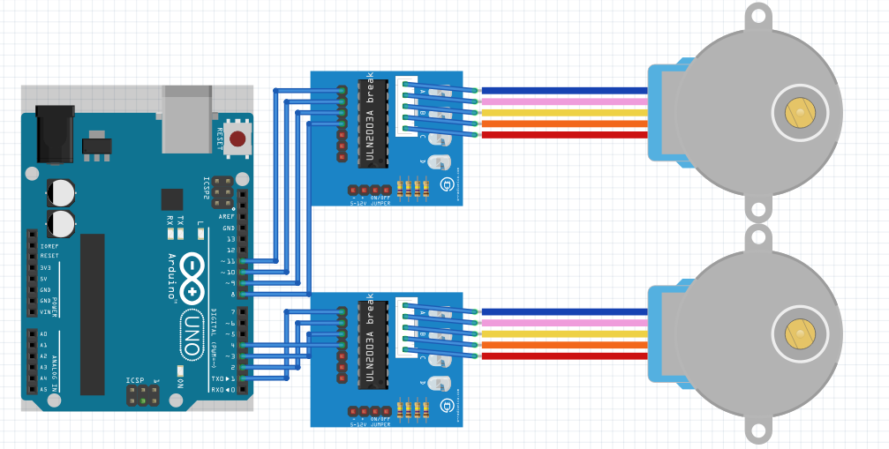
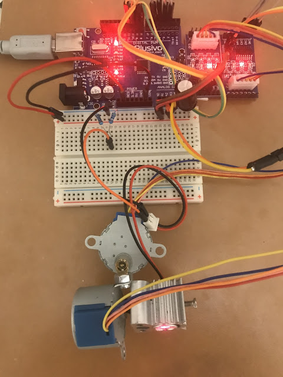
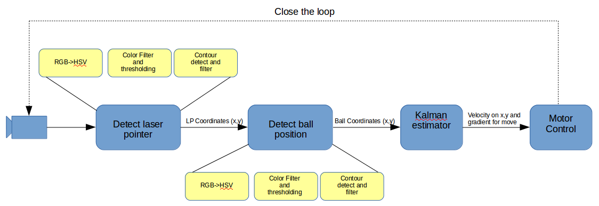

# Laser guided object tracker


## About

Proof of concept for tracking objects using a simple 2D image and a 2 axis joint kinematics with a laser light. Tracking is realized without modeling the 2 axis joint system (forward kinematc transformation) or pinhole camera, neighter geometric distorsions of the camera lenses. The motivation behind was to keep as simple possible, without using any heavy math...and still get to work.

<tr>
  <th>
  <a name="tracker" href=""></a>
  </th>
</tr>

## System concept

The system consists from two parts:
- Motor guidance, an Arduino board [Plusivo](https://www.plusivo.com/)
- Software running on the PC, does the object recognition using [OpenCV](https://opencv.org), estimate the coordinates with a Kalman filter and commands the motors. Note: the previous desing was with servo motors, but due to the low precision, was changed with stepper motors.

### Motor guidance system

The guidance system has 2 unipolar stepper motors, connected to the ULN2003A motor direvers. The stepper motors [28BYJ-48](https://arduinoinfo.mywikis.net/wiki/SmallSteppers) have incorporated geaars divideing the bases steps approximativelly to 4096 microsteps / rotation.
<tr>
<a name="tracker" href=""></a>
<a name="tracker" href=""></a>
</tr>

Once the ```.ino``` file is written to the arduino board, can be accessed over serial. Send in a serial terminal window the ```ls,0``` to list all the avilable commands. It sould look like this.
```
m0mtp,val - stepper 0 move to position plus (clockwhise) n steps
m0mtm,val - stepper 0 move to position minus (anti-clockwhise) n steps
m1mtp,val - stepper 1 move plus (clockwhise) n steps
m1mtn,val - stepper 1 move minus (anti-clockwhise) n steps
pon,val - port x on
poff,val - port x off
m0p,val - stepper 0, current position plus n steps
m0m,val - stepper 0, current position minus n steps
m1p,val - stepper 1, current position plus n steps
m1m,val - stepper 1, current position minus n steps
ls,val - list commands over serial
sh,[0,1] - set home posiion for motor [0,1]
gh,[0,1] - go home motor [0,1]
```

## The Software

<tr>
  <th>
  <a name="tracker" href=""></a>
  </th>
</tr>

The RGB images from the camera are converted in HSV colospace. Here a specific color filter is applied on the image. After the position of the color field is detected, a contour detection algorithm is applied to filter out false detections and get the position of the object tracked in the 2D space. The color to be tracked can be easily adjusted, trough the definitions below. To determin the rights color spaces, use the [color_filterer](https://github.com/fvilmos/color_filterer) software.

```
#Laser pointer color code
OBJ_1_COLOR_CODE=[255,50,105,255,255,255]

#Ball color code
OBJ_2_COLOR_CODE=[10,108,136,62,142,255]
```
The heart of the guidance system is the Kalman estimator (2 dimensional). Currently the predict and correct part is used, without using the prediction when the target is lost (is a constant velocity model, therefore the behaviour can be not the expected one).

## Usage

Admin righs will be needed since the sotware get access to the serial port. 
From Command line: 
```
sudo python3 laser_guidance_ot.py -cam 0 -ser /dev/ttyUSB0

usage: laser_guidance_ot.py [-h] -cam camID -ser serial

optional arguments:
  -h, --help   show this help message and exit
  -cam camID   Camera ID, default 0
  -ser serial  Serial port name

```
After starting the system, the keyboard keys (w,a,s,d,h)can be used to bring the laser pointer in the frame. After this action the (is recommandded) to press the reset button on the Arduino board, this will set the home coordinates on for the motors and the tracking can start.


### Future work

Change color tracker to object detection using machine learning.

## Resources

[Python OpenCV tutorial](https://opencv-python-tutroals.readthedocs.io/en/latest/py_tutorials/py_imgproc/py_colorspaces/py_colorspaces.html#converting-colorspaces).

[Arduino CheepStepper librarry](https://github.com/tyhenry/CheapStepper) - used to control the stepper motors

[Fritzing components for stepper and driver](https://github.com/e-radionicacom/e-radionica.com-Fritzing-Library-parts-)

[Kalman filter intro](https://www.kalmanfilter.net/kalmanmulti.html)

/Enjoy.
